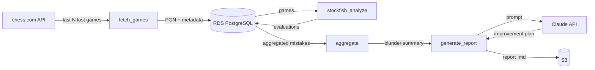
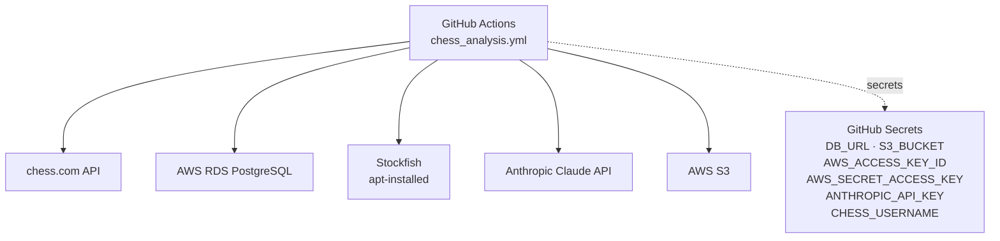

# Architecture Spine — Chess Game Analysis and Improvement Engine

## Design Paradigm

**Scheduled batch pipeline.** A GitHub Actions workflow runs daily, executing five sequential stages: fetch → store → analyze → aggregate → report. Data flows forward only — no stage reads output produced by a later stage. Each stage reads from and writes to RDS; the final stage writes to S3. A failure in any stage is caught, logged, and does not propagate to subsequent stages or to the video pipeline.



## Invariants & Rules

### AD-1 — RDS PostgreSQL is the sole persistent store for game and evaluation data

- **Binds:** CAP-1, CAP-2, CAP-3, all pipeline stages
- **Prevents:** SQLite, in-memory stores, or file-based game storage that cannot survive ephemeral CI runners
- **Rule:** All game records, Stockfish evaluations, and report metadata are written to and read from RDS PostgreSQL. No pipeline stage persists game or evaluation data to local files or the repo.

### AD-2 — Analysis runs as a standalone GitHub Actions workflow

- **Binds:** all pipeline stages
- **Prevents:** coupling analysis failures or runtime to the video pipeline job
- **Rule:** The analysis workflow (`chess_analysis.yml`) has no dependency on `chess_pipeline.yml`. It is triggered independently on its own schedule. A failure in analysis never touches video generation or YouTube upload.

### AD-3 — Analysis pipeline fetches its own games directly from chess.com

- **Binds:** CAP-1, fetch stage
- **Prevents:** dependency on `won_games.json` or the video pipeline's quality filter
- **Rule:** The fetch stage calls chess.com API for **lost** games by the configured time control. It does not read from files produced by the video pipeline.

### AD-4 — Window-based scope; N and time_control are env-var parameters

- **Binds:** CAP-1, CAP-2, CAP-3, CAP-4
- **Prevents:** full history re-analysis on every run; hardcoded time control
- **Rule:** Each run fetches and analyzes the last `ANALYSIS_GAME_COUNT` (default: 20) lost games for `ANALYSIS_TIME_CONTROL` (default: `rapid`). Both are GitHub Actions env vars. Valid values for time control: `rapid`, `blitz`, `bullet`.

### AD-5 — Single Claude API call; no agentic tool use

- **Binds:** CAP-4, report stage
- **Prevents:** Claude querying the database directly or multi-turn orchestration
- **Rule:** The aggregate stage produces a structured Python dict of weakness categories + frequencies. The report stage builds one prompt from that dict and makes one Claude API call. The response is written directly to the report file.

### AD-6 — Reports stored in S3 at a username-scoped path

- **Binds:** CAP-4, report stage
- **Prevents:** committing reports to the repo; flat S3 structure that blocks multi-user extension
- **Rule:** Report path: `s3://{S3_BUCKET}/{username}/{time_control}/{date}.md`. Username and bucket name come from env vars. Reports are write-once per date; re-runs on the same day overwrite.

### AD-7 — Per-game Stockfish failure isolation

- **Binds:** CAP-2, analysis stage
- **Prevents:** a single malformed or unanalyzable game aborting the full run
- **Rule:** Each game's Stockfish analysis runs inside a `try/except`. Failures are logged with the game ID and reason; the game is excluded from aggregation. The run continues.

### AD-8 — Three-table schema with username on all user-owned rows

- **Binds:** CAP-1, CAP-2, CAP-3, CAP-4, RDS
- **Prevents:** flat single-table design that can't support per-move querying; schema rework when multi-user ships
- **Rule:** Three tables — `games`, `evaluations`, `reports` — as defined below. `username` is a non-nullable column on `games` and `reports`. `evaluations` carries no `username` column — username filtering always joins `evaluations → games` on `game_id`; never denormalize `username` onto `evaluations`. No table is omitted or merged.

```
games        (id, username, pgn, date, time_control, result, opponent_rating, fetched_at)
evaluations  (id, game_id, move_number, severity, best_move, eval_delta)
reports      (id, username, time_control, window_size, s3_path, generated_at)
```

## Consistency Conventions

| Concern | Convention |
|---|---|
| Naming | Snake_case for all DB columns and Python modules; `ANALYSIS_*` prefix for all env vars governing this pipeline |
| Severity labels | Two values only: `blunder` (eval_delta ≥ 200 centipawns), `mistake` (eval_delta ≥ 100) |
| eval_delta sign | Centipawns lost by the player being analyzed (`eval_before − eval_after` from the player's perspective); always ≥ 0 for blunders and mistakes; moves where the player gained or held eval are not stored |
| Dates | UTC everywhere; stored as ISO-8601 strings in RDS; S3 path date is `YYYY-MM-DD` |
| Errors — game-level | Stockfish failures per game: log game_id + exception, skip game, continue run (AD-7) |
| Errors — stage-level | chess.com fetch failure, RDS write error, S3 upload failure: log stage + exception, abort run with non-zero exit; no partial-commit retry |
| Username env var | `CHESS_USERNAME` (same as video pipeline); injected via workflow `env:` block |
| Config | All secrets via GitHub Actions secrets; all tunable parameters via `env:` block in the workflow |

## Stack

| Name | Version |
|---|---|
| Python | 3.11 |
| python-chess | 1.10.0 |
| psycopg2-binary | current stable |
| boto3 | current stable |
| anthropic SDK | current stable |
| Stockfish | system package (ubuntu-latest: `apt-get install stockfish`) |
| AWS RDS | PostgreSQL 16 |
| AWS S3 | — |

## Structural Seed



```
chess-pl/
  analysis/
    fetch_games.py        # CAP-1: fetch last N lost games from chess.com
    stockfish_analyze.py  # CAP-2: per-move Stockfish evaluation, per-game isolation
    aggregate.py          # CAP-3: group evaluations into weakness categories
    generate_report.py    # CAP-4: build prompt, call Claude, upload report to S3
    db/
      schema.sql          # CREATE TABLE statements for games, evaluations, reports
      client.py           # RDS connection helper (reads DB_URL from env)
  .github/workflows/
    chess_analysis.yml    # standalone analysis workflow
```

## Capability → Architecture Map

| Capability | Lives in | Governed by |
|---|---|---|
| CAP-1 — Game storage | `analysis/fetch_games.py` + `games` table | AD-1, AD-3, AD-4, AD-8 |
| CAP-2 — Blunder detection | `analysis/stockfish_analyze.py` + `evaluations` table | AD-1, AD-7, AD-8 |
| CAP-3 — Pattern aggregation | `analysis/aggregate.py` | AD-4, AD-5 |
| CAP-4 — Improvement plan | `analysis/generate_report.py` + S3 | AD-5, AD-6 |

## Deferred

- **RDS schema migration strategy** — Alembic vs raw SQL; deferred to implementation. Schema is simple enough for initial `schema.sql` applied once; revisit when first schema change lands.
- **Stockfish analysis depth** — env-var parameter (`STOCKFISH_DEPTH`, suggested default: 15); implementation detail, not an invariant.
- **Analysis workflow schedule** — cron timing is operational, not architectural; set independently of video pipeline.
- **S3 bucket region and RDS co-location** — infrastructure setup; must be same AWS region to avoid cross-region data transfer costs, but the choice is not an architectural invariant.
- **RDS connection pooling** — not needed for a single-job, sequential pipeline; revisit if concurrent access is introduced.
- **Multi-user access control for S3 reports** — path structure is multi-user ready (AD-6); IAM policy and presigned URL strategy deferred until multi-user ships.
- **Re-analysis of already-stored games** — current design re-fetches the window fresh each run and overwrites evaluations; a `analyzed_at` timestamp on `evaluations` to skip re-analysis is an optimization, deferred.
